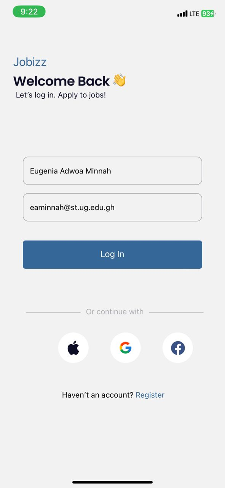
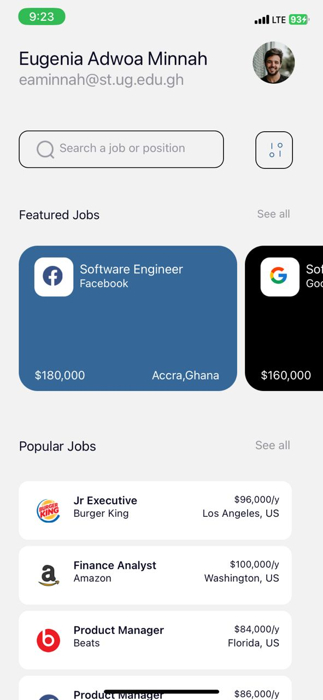
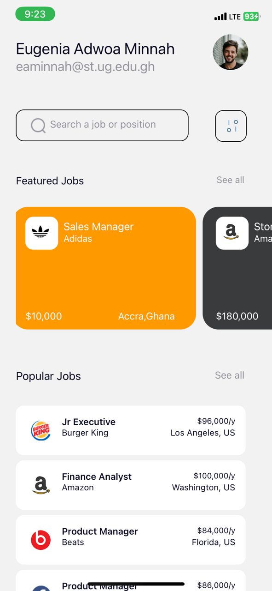
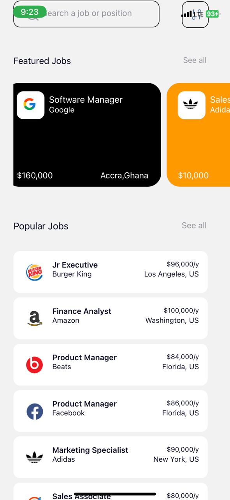

# rn-assignment4-11156875

This repository contains the implementation of a mobile application designed to replicate a UI mockup. The application features a login screen, a home screen displaying user information, and components for popular and featured job cards.

## Components Usage
1.LoginScreen
Displays fields for entering name and email.
Upon pressing the login button, it passes the entered name and email to the home screen.

2.Home Screen
Displays the logged-in user's name and email.
Styled to match the provided UI design.

4.Popular Jobs Card Component: 
Renders job cards for popular jobs.

5.Featured Jobs Card Component: 
Renders job cards for featured jobs.

Each card component accepts props for job details (such as job title, company, location, icon,salary,backgroundcolor).
Designed to display at least 8 different job cards in each section, adhering to the UI mockup.

## Screenshots
LoginScreen:

HomeScreen:

